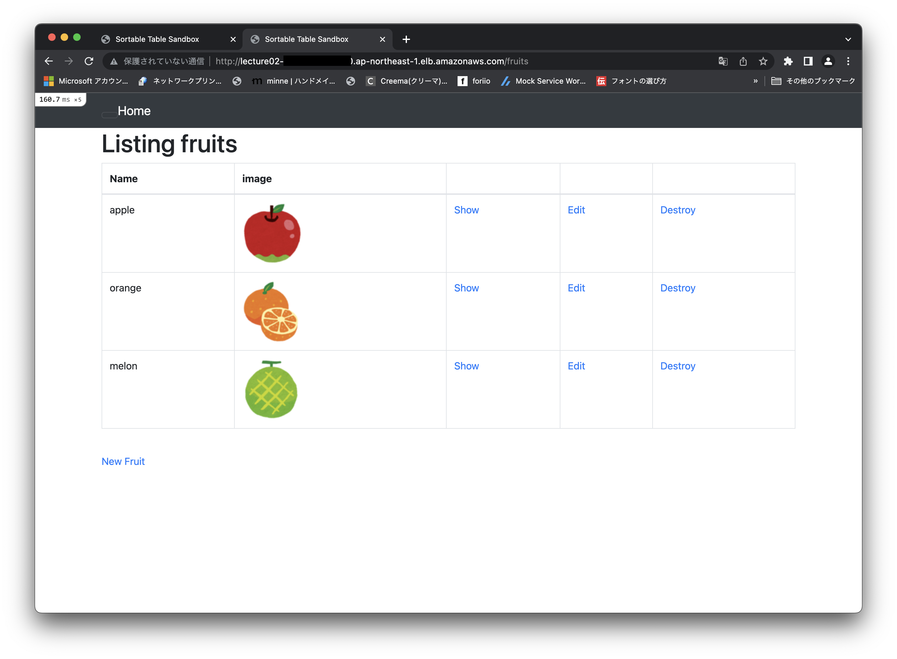

# AWSフルコース 第5回課題

 ## やったこと
 ### EC2にサンプルアプリケーションをデプロイして動作させる
 - 組み込みサーバーだけでアプリを動かす
 - サーバーアプリケーションを分けて動かす
 - ELB(ALB)を追加
 - S3を追加
 - 環境を構成図に起こしてみる


## EC2の環境構築
- 第4回課題でVPCとEC2とRDSは設定済
#### 1.  パッケージをアップデートする
- yumコマンドでパッケージをアップデート
```
$ sudo yum update
Is this ok [y/d/N]:`と聞かれるので`y`を入力してEnter
完了しました!
```

#### 2.  必要なパッケージをインストールする
- Amazon LInuxは初期状態だと最低限のパッケージかないのでRailsアプリの起動に必要なパッケージをインストールする
```
$ sudo yum -y install gcc-c++ make patch git curl zlib-devel openssl-devel ImageMagick-devel readline-devel libcurl-devel libffi-devel libicu-devel libxml2-devel libxslt-devel
完了しました!
$ sudo yum -y install mysql-server mysql-devel
完了しました!
```

#### 3. rbenvとruby-buildをインストールする
- rbenvをインストール
`$ git clone https://github.com/sstephenson/rbenv.git ~/.rbenv`

 - .bash_profileの設定
 ```
$ echo 'export PATH="$HOME/.rbenv/bin:$PATH"' >> ~/.bash_profile
$ echo 'eval "$(rbenv init -)"' >> ~/.bash_profile
$ source .bash_profile
```

- ruby-buildをインストール
`git clone https://github.com/sstephenson/ruby-build.git ~/.rbenv/plugins/ruby-build`

#### 4. ruby(version : 3.1.2)をインストールする
 - rubyのインストール
 ```
 $ rbenv install 3.1.2 -v
 $ rbenv rehash
 $ rbenv global 3.1.2
 $ ruby —version
 ```
 - rubyのインストール完了


#### 5. rails(version : 7.0.4)をインストールする
 - railsのインストール
 ```
 $ gem install rails -v '7.0.4'
 $ rails --version
 ```
- railsのインストール完了


#### 6. node.js(version : v17.9.1)をインストールする
- node.jsのインストール
 ```
$ curl --silent --location https://rpm.nodesource.com/setup_14.x | sudo bash -
$ sudo yum install -y nodejs
$ node --version
 ```
- node.jsのインストール完了


#### 7. yarn(version : 1.22.19)をインストールする
- yarnのインストール
 ```
$ npm install -g yarn
$ yarn --version
 ```
- yarnのインストール完了


#### 8. bundler(version : 2.3.14)をインストール
- Bundlerのインストール
`$ gem install bundler:2.3.14`
- Bundlerのインストール完了


## EC2インスタンスにデプロイ
#### 1.  ディレクトリの作成
- ディレクトリを作成  `$ sudo mkdir /var/www/`
- 権限を変更  `$ sudo chown ec2-user /var/www/`
- 作成したディレクトリに移動 `$ cd /var/www/`

#### 2.  サンプルアプリをクローン
- アプリをクローン `$ git clone アプリ`

#### 3.  必要なライブラリをインストール
- アプリディレクトリに移動する
`$ cd raisetech-live8-sample-app`
- Bundlerでライブラリをインストール
`$ bundle install`

## EC2の組み込みサーバーでアプリを動かす
- RDSは第4回課題で作成したものを使用

#### 1.  MySQLのインストール
 ```
MYSQL_PACKAGE_URL="https://dev.mysql.com/get/mysql80-community-release-el7-7.noarch.rpm"
$ sudo yum localinstall -y $MYSQL_PACKAGE_URL
$ sudo yum install -y mysql-community-devel
$ sudo yum install -y mysql-community-server
 ```

#### 2.  MySQLサーバーの起動＆確認
 ```
$ sudo service mysqld start && sudo service mysqld status
 ```

#### 3.  config/database.yml を編集
`vim config/database.yml`
- RDSのユーザ名とパスワードを入力
   - username: RDSのユーザー名
   - password: RDSのパスワード
- RDSのエンドポイントをhostに記入。DBの接続先をRDSする。
   - host: RDSのエンドポイント
- socketのディレクトリを確認
`mysql_config --socket`
- developmentとtestのsocketを変更
   - socket: 確認したソケットのディレクトリパス

#### 4.  HTTPが繋がるようにポートを編集
- EC2のセキュリティグループ → `インバウンド` → `インバウンドルールを編集`
   - タイプ：カスタムTCP
   - プロトコル：TCP
   - ポート範囲：3000
   - 送信元：カスタム/0.0.0.0/0

#### 5.  DB作成
 ```
$ rails db:create
$ rails db:migrate
 ```

#### 6.  Webpackerのインストール
 ```
$ bundle exec rails webpacker:install
 ```

#### 7.  rails起動
 ```
$ bundle exec rails s -b 0.0.0.0
 ```
 - http://(EC2インスタンスのパブリックIPアドレス):3000にアクセス
 - 起動！！
 


## サーバーアプリケーションを分けて動かす
 - Web サーバー(Nginx)、AP サーバー(Unicorn)で動かす
 #### 1.  nginxの設定
 - サーバーをアップデート
``` 
$ sudo yum update
```
 - Nginxをインストール
 ```
$ sudo amazon-linux-extras install nginx1
Is this ok [y/d/N]: y
完了しました！
$ nginx -v
 ``` 
- Nginxのインストール完了


- Nginxを起動
 ``` 
$ sudo systemctl start nginx
//インスタンス起動時に自動起動するよう設定
$ sudo systemctl enable nginx
//ステータス確認
$ sudo systemctl status nginx
 ``` 
- ` Active: active (running)` が表示されたら起動完了
- Nginxの設定ファイルを作成する
`$ sudo vi /etc/nginx/conf.d/<アプリケーション名>.conf`

- 設定ファイルの中身（aisetech-live8-sample-app.conf）
```
upstream unicorn_server {
  # Unicornと連携させるための設定。
  # config/unicorn.rb内のunicorn.sockを指定する
  server unix:/var/www/アプリケーション名/unicorn.sock;
}

server {
  listen 80;
  # EC2を再起動したらインスタンス
  server_name EC2インスタンスのパブリックIPアドレス;

  client_max_body_size 2g;

  # 接続するrootディレクトリ
  root /var/www/アプリケーション名/public;

  # assetsファイル(CSSやJavaScriptのファイルなど)にアクセスが来た際に適用される設定
  location ^~ /assets/ {
    gzip_static on;
    expires max;
    add_header Cache-Control public;
  }

  try_files $uri/index.html $uri @unicorn;

  location @unicorn {
    proxy_set_header X-Forwarded-For $proxy_add_x_forwarded_for;
    proxy_set_header Host $http_host;
    proxy_redirect off;
    proxy_pass http://unicorn_server;
  }

  error_page 500 502 503 504 /500.html;
}
```

- Nginxを再起動して設定ファイルを再読み込み
```
$ cd ~
$ sudo systemctl restart nginx
```

#### 2. unicornの設定
- Gemファイルの確認(gem 'unicorn'が入っていればOK)
```
$ cat Gemfile
gem 'unicorn'
```


- ない場合は`$ sudo vim Gemfile`で「gem 'unicorn'」を追加して`$ bundle install`
- unicorn.rbを編集
```
$ vim config/unicorn.rb
nginxに設定している場所に合わせるように修正
listen '/var/www/raisetech-live8-sample-app/unicorn.sock'
pid    '/var/www/raisetech-live8-sample-app/unicorn.pid'
```

#### 3. precompile(ProductionモードでCSSやJSを都度コンパイルしない（事前コンパイル）の設定を行う)
 - production.rbを編集
```
$ sudo vim config/environments/production.rb

- production.rbを編集する
config.assets.compile = false
Rails.application.config.assets.precompile += [‘*.js’, ‘*.css’]  // jsとCSSをコンパイルさせる

- precompileする
$ rake assets:precompile

- ファイルが生成されているか確認
cd public/assets
```

#### 4. アプリを起動する
 - Nginxを起動
` $ sudo systemctl start nginx`
 - Nginxの起動を確認する
`$ sudo systemctl status nginx`
 - Unicornを起動する
` $ bundle exec unicorn_rails -c config/unicorn.rb -D`
 - Unicornの起動を確認する
` $ ps aux | grep unicorn`
 - サーバーアプリケーション(Unicorn + Nginx)で起動
 


## ELB(ALB)を追加する
#### 1.  パブリックサブネットを追加で作成する
- VPC→サブネット→サブネットの作成
- サブネット作成画面を表示
    - VPCID: 設定したVPCを選択
    - 名前タグ: 任意の名前
    - VPC ID: 現在使用しているVPCを選択
    - アベイラビリティーゾーン: ap-northeast-1c
    - IPv4 CIDR ブロック: 10.0.11.0/24
- サブネットルートテーブル設定
    - VPC→サブネット→作成したサブネットを選択→ルートテーブルの関連付けを編集
    - ルートテーブルID：作成したルートテーブルを選択
- ELBの作成
    - EC2→ロードバランサー→ロードバランサーの作成→「ALB」を選択
- Basic configuration
    - 名前： 任意の名前
    - スキーム： インターネット向け
    - IPアドレスタイプ： ip4
- Network mapping
    - VPC： 作成したVPC
    - 1a-northeast-1a： 1aパブリックサブネット
    - 1a-northeast-1c： 1cパブリックサブネット
- Security groups
    - 新しいセキュリティグループを作成する
    - セキュリティグループ名： 任意の名前
    - インバウンドルールを追加
         - タイプ： HTTP 
         - プロトコル： TCP
         - ポート範囲： 80
         - ソート： 0.0.0.0/0
- Listeners and routing
    - ロードバランサーのプロトコル： HTTP
    - ロードバランサーのポート： 80
- ルーティングの設定
    - 新しいターゲットグループ
    - 名前： 任意の名前
    - ターゲットの種類： インスタンス
    - プロトコル： HTTP1
    - ポート: 80
- ヘルスチェック
    - プロトコル： HTTP
    - パス： /
        - ポート： トラフィックポート
        - 正常のしきい値： そのまま
        - 非正常のしきい値： そのまま
        - タイムアウト： そのまま
        - 間隔： そのまま
        - 成功コード： 200

## nginxの設定ファイルをELB用に修正
`$ sudo vim /etc/nginx/conf.d/<アプリケーション名>.conf`

- 設定ファイル（aisetech-live8-sample-app.conf）を修正
```
server {
  server_name ELBのDNSアドレス EC2インスタンスのパブリックIPアドレス;

```

- 設定ファイル(nginx.conf)を修正
```
$ sudo vim /etc/nginx/nginx.conf

http {
    server_names_hash_bucket_size 64; 　//http配下に追加

#略
```

## unicornの設定ファイルの修正
```
config/environments/development.r

～略
config.hosts << “”ELBのDNSアドレス.amazonaws.com”
end

```

 - nginxとunicornを再起動
 - ELBのDNSアドレスで起動！！



 - ELBのHealthチェック

 


 ## S3に画像を保存する
#### 1.  S3バケットを作成
- 一般的な設定
    - バケット名： 任意の名前
    - AWSリージョン：アジアパシフィック(東京)ap-northeast-1
- オブジェクト所有者
    - ACL無効(推奨)
- このバケットのブロックパブリックアクセス設定
    - すべてのチェックを外す
    - 現在の設定により、このバケットとバケット内のオブジェクトが公開される可能性があることを承認します　にチェック
- バケットのバージョニング
    - 無効にする
- デフォルトの暗号化
    - サーバー側の暗号化：無効にする
- 詳細設定：無効にする
- バケットを作成

#### 2.  IAMユーザーにS3の権限を付与する
- IAM→ユーザー→使っている名前
- 許可→許可ポリシー→許可を追加
- ポリシーを直接アタッチする
- 「AmazonS3FullAccess」にチェック
- 許可を追加

#### 3. S3に画像を保存(ActiveStrageを使って画像をあげる)
- Active Storageの導入
```
$ rails active_storage:install
$ rails db:migrate
```
- ActiveStrage用の設定を追加(アプリ側に設定済)
```
$ sudo vim app/models/fruits.rb
has_one_attached :image
```
- ファイルの保存先をローカルからS3に変更(アプリ側に書かれている)
```
$ sudo vim config/storage.yml

amazon:
  service: S3
  access_key_id: Access key ID
  secret_access_key: Secret access key
  region: リージョンコードの指定
  bucket: バケット名

```

- 本番環境でS3を使えるようにする（アプリ側に設定済）
```
$ sudo vim config/environments/production.rb
config.active_storage.service = :amazon
```

- Gemファイルの確認(gem ‘aws-sdk-s3が入っていればOK)
```
$ cat Gemfile
gem 'aws-sdk-s3'
```
- ない場合は`$ sudo vim Gemfile`で「gem 'aws-sdk-s3'」を追加して`$ bundle install`
- S3の設定ができていれば画像がS3に保存される

- 起動！


- S3に画像が保存されている


## エラー
 #### 1.  エラー①：EC2が起動しない
` Permission denied (publickey,gssapi-keyex,gssapi-with-mic).` 
- EC2起動時に出るPermissionエラー
- 解決：ssh -i pemファイル ec2-user@ec2パブリック IPv4 DNSを入力する際に`ec2-user@` が抜けていて権限が通らなかった

#### 2. エラー②：nginxが起動しない時
- nginx.confが間違っていないかを確認してみる
- nginx.conf下の構文チェックをしてくれる
- エラーの場合はエラー文が表示される(パスの間違いとかが多い)
- エラー文をなおすと起動することが多かった
- 下の写真のようになって入れば問題なし
```
$ sudo nginx -t
nginx: the configuration file /etc/nginx/nginx.conf syntax is ok
nginx: configuration file /etc/nginx/nginx.conf test is successful
```
#### 3. エラー③：本番環境でCSSが反映されない


- application.debug××××××.cssにエラーが出ているのでファイルがコンパイルできているか確認
```
$ cd public/assets
エラーで生成されていないファイルが見つかった
```

- 解決策:config.assets.debugをfalseにする
```
$ cd config/environments
$ sudo vim development.rb
config.assets.debug = false

- assetファイルのキャッシュを消してからasset再コンパイル
rails tmp:cache:clear
bundle exec rake assets:clobber
bundle exec assets:precompile
```
- [公式](https://railsguides.jp/configuring.html#アセットを設定する)によると、「3.3.10 config.assets.debugはデバッグ用にアセットの結合と圧縮をやめるかどうかを指定します。development.rbではデフォルトでtrueに設定されます。」とあったのでデバッグ用にファイルを生成しようとして失敗していたのかな？と思いました。
- 無事解決

#### 4. エラー④：ELBのDNSアドレスで403エラー
- 設定ファイル（aisetech-live8-sample-app.conf）のDNSアドレスが間違っている
- DNSアドレスを入れたら`could not build server_names_hash, you should increase server_names_hash_bucket_size: 32`エラー
- nginx.confファイルにserver_name_hash_bucket_sizeを設定をする
- 再起動
- 解決

#### 5. エラー⑤：ELBのHealthチェックが通らない
- ELBのDNSアドレスを叩いたら画面は表示されるのに、healthチェックが403になっていた
`エラー：[error] 8268#8268: *1 directory index of “/var/www/アプリ名/public/" is forbidden, client: 192.168.33.1, server: localhost, request: "GET / HTTP/1.1", host: "192.168.33.10"`
- public配下にindex.htmlがないため403エラーになっている
- 解決策① /public配下にindex.htmlを作成
`touch /public/index.html`
    - healthチェックは通るが、画面には作成したindex.htmlが表示される(index.htmlがtopになるため)
- 解決策② /public配下ではなく/app/views/fruits/index.html.slimを見に行くように設定を変更する
```
$ sudo vi /etc/nginx/conf.d/<アプリケーション名>.conf
root /var/www/アプリ名/app/views/fruits;
location / {
    try_files $uri/index.html $uri @unicorn;
}
```


## アプリの起動・停止
#### 1.起動 
```
sudo systemctl start nginx
cd /var/www/raisetech-live8-sample-app/
bundle exec unicorn_rails -c config/unicorn.rb -D
```

#### 2.停止
```
sudo systemctl stop nginx
ps aux | grep unicorn
kill -9 マスターのpidID
```

## 構成図

 


## 参考資料
- VPC作成からEC2インスタンス起動を構成図をみながらやってみる([※１](https://dev.classmethod.jp/articles/creation_vpc_ec2_for_beginner_1/))
- Ruby on Rails unicornをNginx環境下で動かす時の設定方法([※2](https://y-hilite.com/2857/))
- NGINX　エラーログを見て解決する([※3](https://qiita.com/kazumawada/items/a78af229e1a46a4e80f2))
- ALBの作成([※4](https://docs.aws.amazon.com/ja_jp/elasticloadbalancing/latest/application/create-application-load-balancer.html))
- Active Strageを使って画像をアップしよう([※5](https://pikawaka.com/rails/active_storage))

