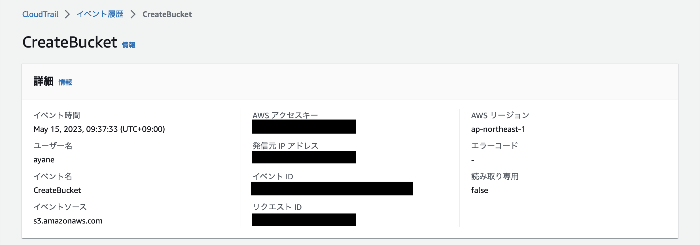
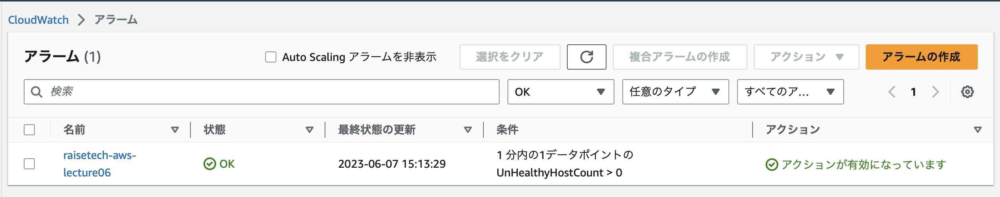
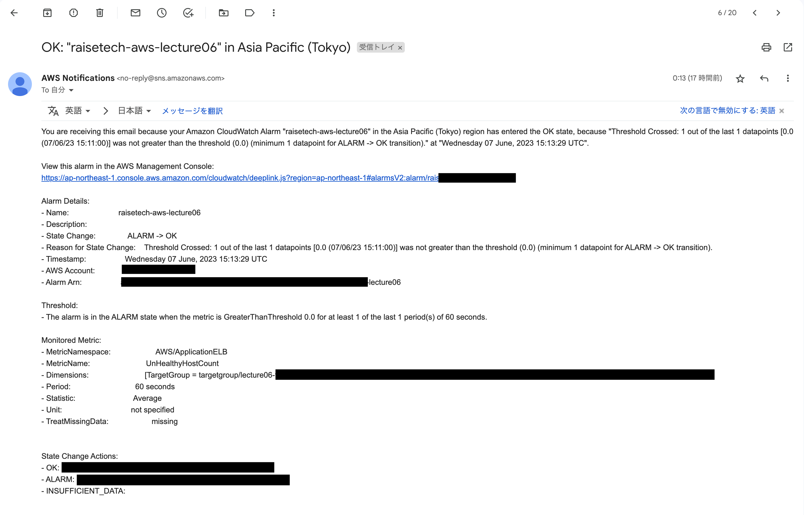
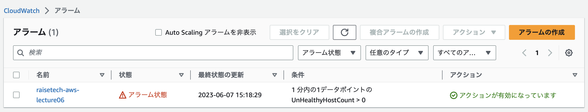
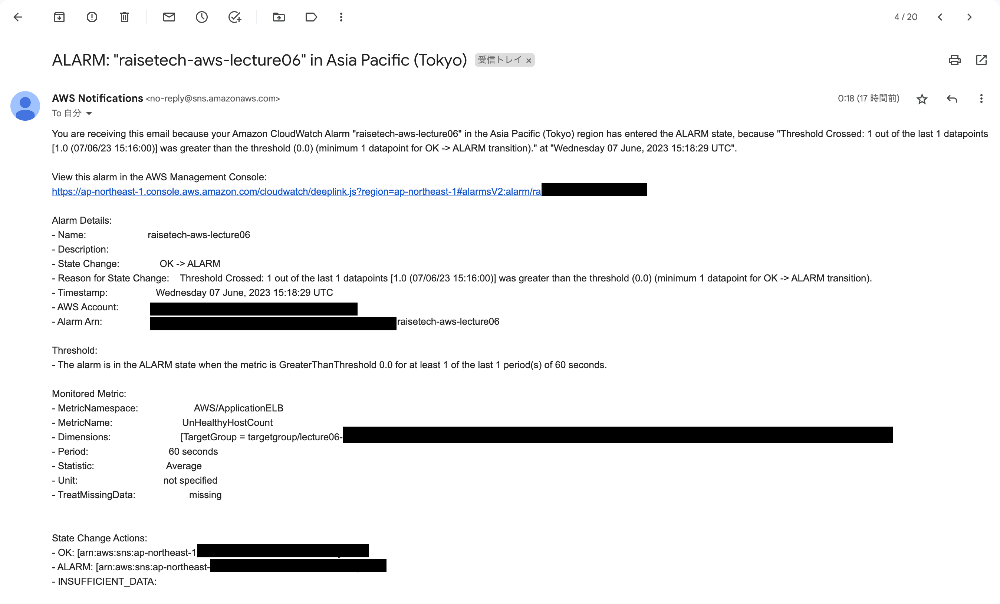
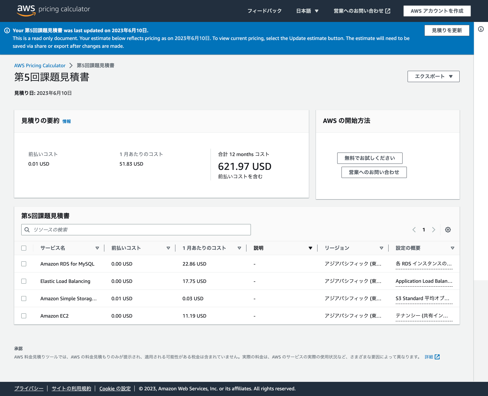
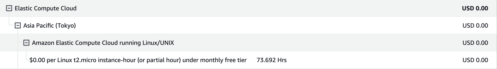

# AWSフルコース 第6回課題

 ## やったこと
  - CroudTrail
    - 最後に利用したAWSの記録をCloudTrailのイベントから探し出す
  - CroudWatch
    - CloudWatchアラームを使ってALBのアラームを設定してメールを通知する
  - 見積もり
  - 請求額の確認
 
 ## CroudTrail
 ### 最後に利用したAWSの記録をCloudTrailのイベントから探し出す
 - イベントの情報をピックアップする(イベント名と含まれている内容)
   - イベント名： CreateBucket(S3バケットの作成)
   - 内容： イベント、ユーザー名、イベントソース
   
  
 
  
 ## CroudWacth
 ### CloudWatchアラームを使ってALBのアラームを設定してメールを通知する
 
 #### 1. CloudWatchアラームを作成する
  - CloudWatchの画面 → すべてのアラーム → 「アラームの作成」
  - 「メトリクスの選択」 → 「ApplicationELB」 → 「AppELB別、AZ別、TG別メトリクス」
  - 作成したロードバランサーを選択(ALB) → 「メトリクスの選択」
    - 期間：1分
    - 条件：静的、0より大きい
    - 「次へ」
  - 通知
    - アラーム状態
    - 通知の送信先を設定
  - 「通知の追加」
    - OK
    - 通知の送信先を設定
  - アラーム名を記入
  - 「アラームの作成」
    
 #### 2. CloudWatchアラームの確認
 - Rails アプリケーションが使える時(nginx + unicorn起動時)
   - 状態：OK
   - AWS-CroudWacth画面
 
 
   - 登録したSNSに届いたメッセージ画面(サーバー起動後)
   
 
 
 - Rails アプリケーションが使えない時(nginx + unicorn停止時)
   - 状態：アラーム状態
   - AWS-CroudWacth画面
   
  
   - 登録したSNSに届いたメッセージ画面(サーバー停止後)
   
  
 
 ## AWS無料見積もり
 ### AWSの見積もりを作成する
  - 第5回課題の見積もりです
  - 使用サービス: EC2,RDS,ALB(ELB),S3
  
  

https://calculator.aws/#/estimate?id=6198e512675a0a2582a3dc94bd1e9ccdd4f349bb
 
 
 ## 利用額の確認
 ### マネジメントコンソールから利用料金を確認する
 - 先月の請求情報から、EC2 の料金がいくらか確認してください。
 - 無料利用枠で収まっていますか?
   - 0円でした。無料枠でおさまっています。
 
  
    
 
 

