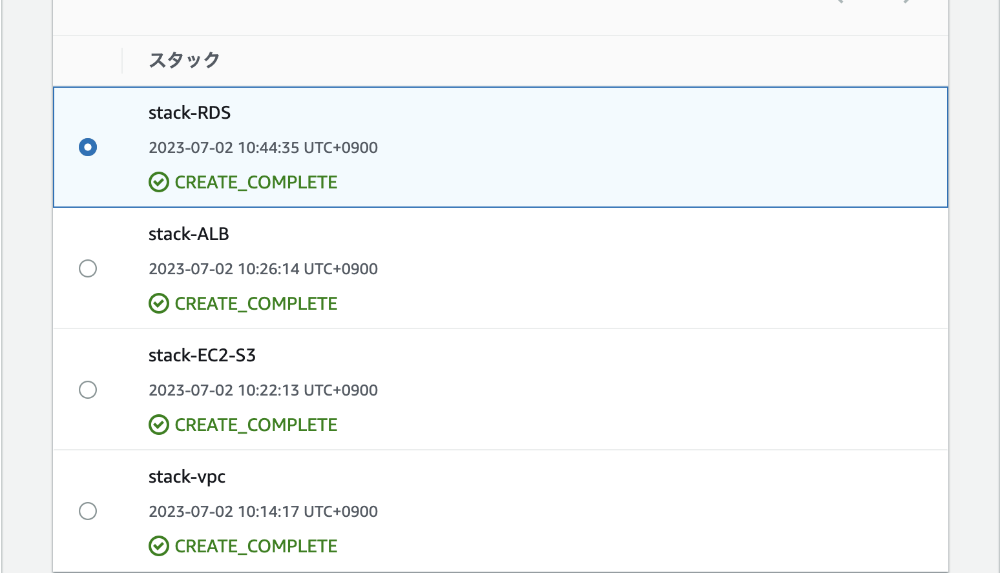
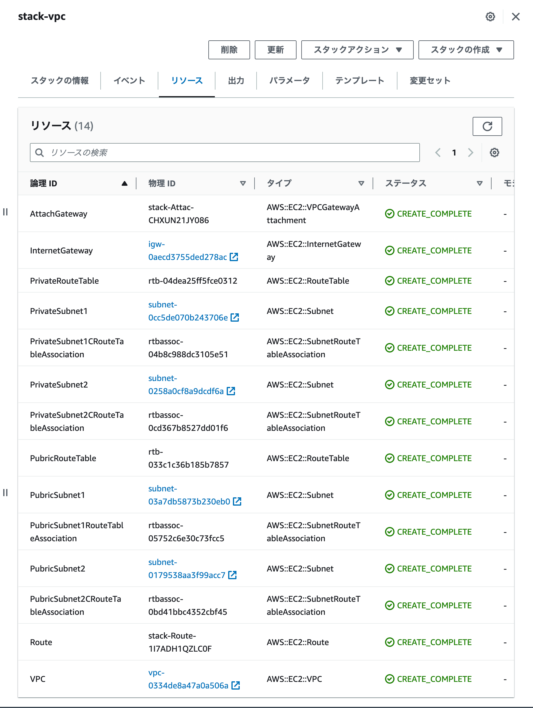
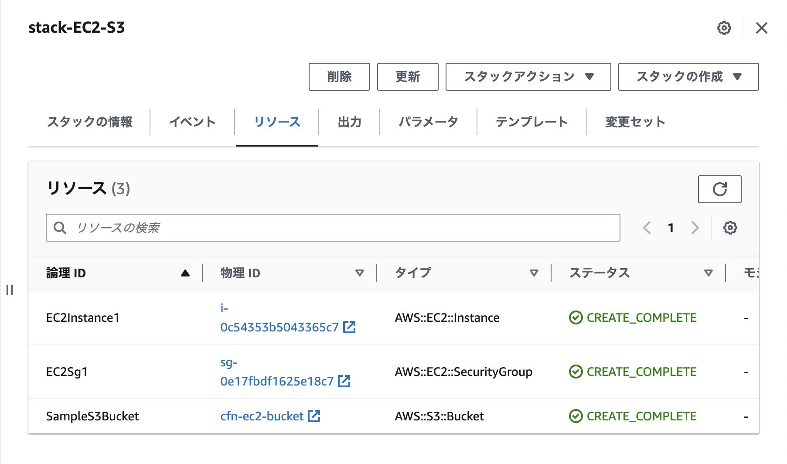
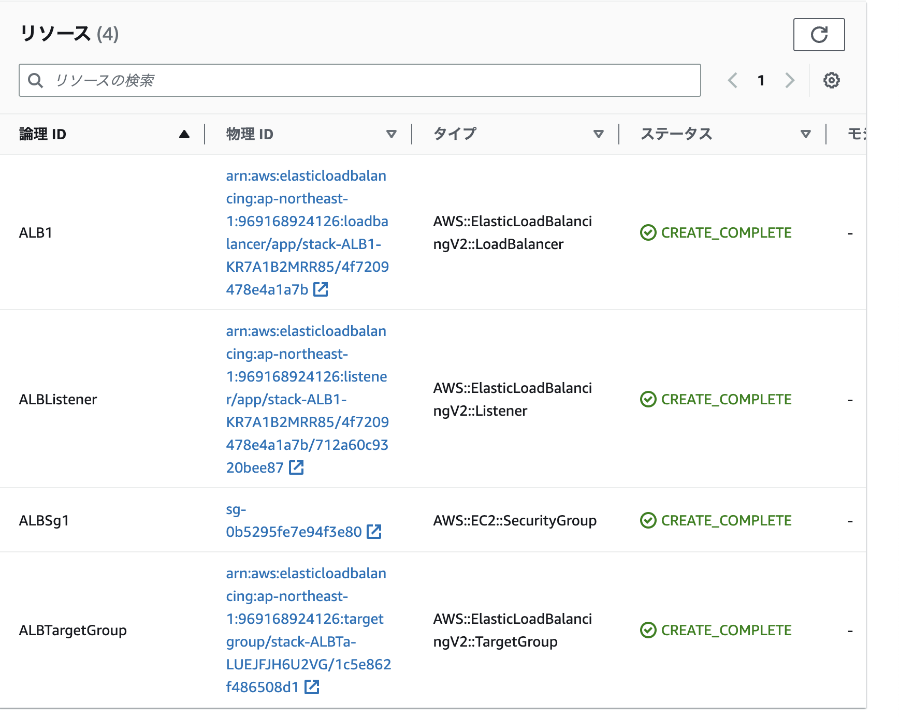
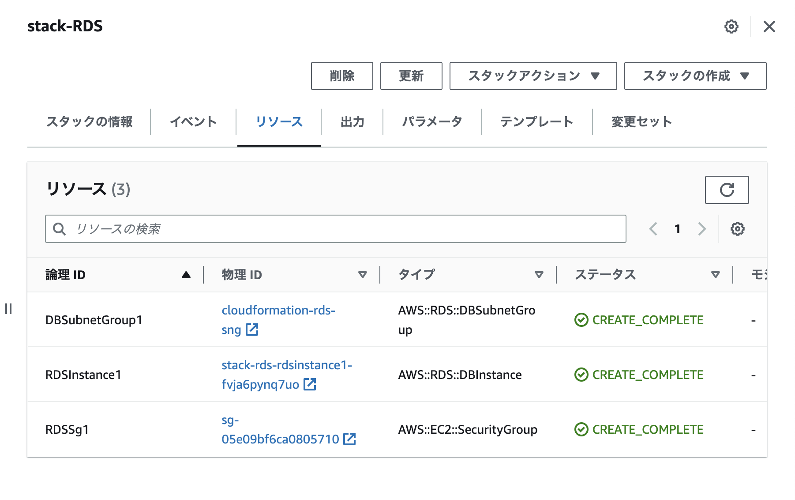

# AWSフルコース 第10回課題

## やったこと
  - CroudFormationを利用して、環境のコード化を行う
  

## VPCの作成
 - lecture10-yml/01_create_vpc.yamlに記載
 - まずはVPCとサブネットを作成し、インターネットゲートウェイとルートテーブルを紐付ける

## EC2の作成
 - lecture10-yml/02_create_ec2-s3.ymlに記載
 - 作成したVPCにEC2を配置する

## S3の作成
 - lecture10-yml/02_create_ec2-s3.ymlに記載
 - 作成したVPCにS3を配置する

## ALBの作成
 - lecture10-yml/03_create_alb.ymlに記載
 - ALBを作成しヘルスチェックを行う

## RDSの作成
 - lecture10-yml/04_create_rds.ymlに記載
 - 作成したEC2にRDSを作成する
 - デフォルトでRDSを削除した際に自動でスナップショットを取るになっているので注意
 - スナップショットが不要な場合は、`DeletionPolicy: Delete`を設定する

## スタックの作成
### スタックを作成方法
  - スタックの作成
  - テンプレートの準備完了
  - テンプレートファイルのアップロード　→ ファイルの選択　→ 作成したファイルのパス
  - 「次へ」
  - スタックの名前
  - 「次へ」
  - ポリシーの設定、スタックの作成オプションなどあれば設定する
  - 「次へ」
  - 設定したファイルの確認
  - 「送信」
  - CREATE_COMPLETE になれば作成完了
  - VPCコンソールで設定した内容が反映されていることを確認

## 全体のスタック

## 個別スタック

  - VPCスタック
  

  - EC2,S3スタック
  

  - ALBスタック
  

  - RDSスタック
  

  

